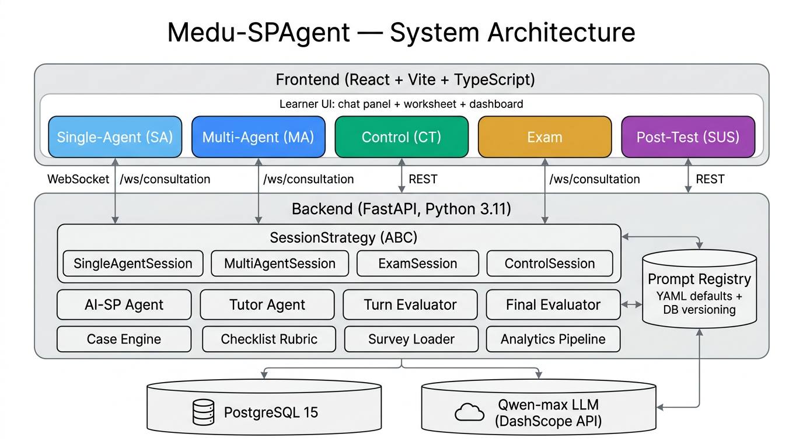
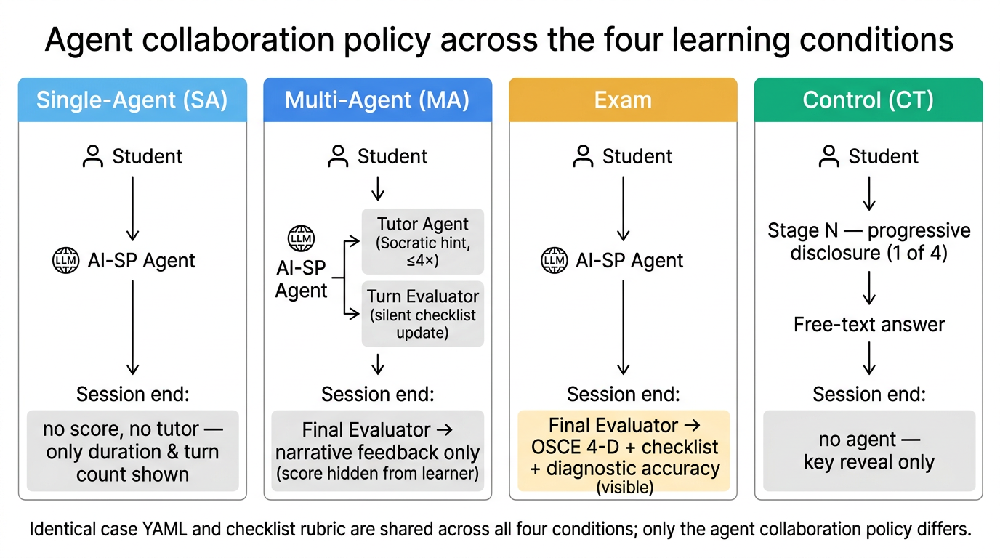

# Medu-SPAgent — Medical Education SP Agent

面向 *Medical Education* 期刊投稿的 AI 标准化病人 (Standardized Patient, SP) 训练与研究平台。
平台围绕 **「单智能体 vs 多智能体」** 的对照实验设计，提供四种学习方法
（**SA / MA / CT / Exam**）与一套 **后测问卷**，并配套集中化 Prompt 库与论文级数据导出。

> 学生 Pipeline（学习 → 考试 → 后测）由研究者口头指引，系统不强制顺序，
> 仅在每条 `TrainingSession` 上记录所选 `method` 字段，所有训练历史
> 都会显式标注本次采用的是哪种方法。

---

## 1. 四种学习方法 + 后测

| ID | 中文名 | 智能体组成 | 学生可见反馈 | UI 入口 | 数据落库 |
|---|---|---|---|---|---|
| `single_agent` | **单智能体学习 (SA)** | 仅 AI-SP | 无（结束页只回顾用时与提问次数） | `/single/:caseId` | `messages` + `training_sessions` |
| `multi_agent` | **多智能体学习 (MA)** | AI-SP + Tutor + Turn-Evaluator (+ Final-Evaluator) | 实时 checklist、苏格拉底式导师提示；结尾屏蔽分数仅展示叙述反馈 | `/consultation/:caseId` | `messages` + `evaluation_snapshots` + `final_evaluations` |
| `control` | **对照学习 (CT)** | 无 LLM 参与（确定性脚本） | 4 阶段渐进披露 + 阶段题；最后展示参考答案 | `/control/:caseId` | `ct_steps` |
| `exam` | **考试方法 (Exam)** | AI-SP + Final-Evaluator | 过程中无反馈，结束后给出 OSCE 4 维 + 诊断正误 + checklist 命中 | `/exam/:caseId` | `messages` + `final_evaluations` |
| `post_test` | 后测问卷 | — | SUS 10 项 + 开放题 | `/post-test` | `survey_responses` |

> **SA vs MA** 是核心对照：两者对话界面几乎一致，只是 SA 关闭了 Tutor 与 Turn-Evaluator，
> 用以分离「**多智能体脚手架**」相对于「**纯 LLM 对话**」的增益。SA 与 MA 都不向学生展示
> 最终分数，避免学习路径中的评分焦虑污染体验测量。

---

## 2. 系统架构

> 论文级矢量/位图架构图位于 `docs/medu-spagent-architecture.png`
> （总体架构）和 `docs/medu-spagent-methods.png`（四方法对照）。
> 方法学文本见 `docs/METHODOLOGY.md`。




### 2.1 总体模块

```
┌────────────────────────────────────────────────────────────────────┐
│                      Frontend (React + Vite)                        │
│  Home  →  Case Select  →                                            │
│   ├── SingleAgent  (SA, /single/:caseId)                            │
│   ├── Consultation (MA, /consultation/:caseId)                      │
│   ├── ControlLearning (CT, /control/:caseId)                        │
│   ├── Exam        (Exam, /exam/:caseId)                             │
│   └── PostTest, Dashboard, PromptAdmin                              │
└──────────────────────────────┬─────────────────────────────────────┘
        WebSocket (SA/MA/Exam)        REST (CT / surveys / admin / 数据)
┌──────────────────────────────┴─────────────────────────────────────┐
│                     Backend (FastAPI, Python 3.11)                  │
│  ┌──────────────────────────────────────────────────────────────┐  │
│  │              SessionStrategy  (abstract base class)           │  │
│  │  ┌──────────────┬──────────────┬──────────────┬──────────┐   │  │
│  │  │ SingleAgent  │ MultiAgent   │   Exam       │ Control  │   │  │
│  │  │  Session     │  Session     │   Session    │ Session  │   │  │
│  │  └──────┬───────┴──────┬───────┴──────┬───────┴──────────┘   │  │
│  │         │ SP-only      │ SP+Tutor+Eval│ SP + Final-Eval       │  │
│  └─────────┼──────────────┼──────────────┼─────────────────────┘  │
│            ▼              ▼              ▼                          │
│      ┌──────────────────────────────────────────┐                  │
│      │  Agents:  AI-SP  /  Tutor  /  Turn-Eval  │                  │
│      │           /  Final-Evaluator              │                  │
│      └────────────────────┬─────────────────────┘                  │
│                           │   prompts come from ↓                  │
│      ┌────────────────────▼─────────────────────┐                  │
│      │  Prompt Registry  (YAML defaults + DB)   │                  │
│      └──────────────────────────────────────────┘                  │
│  Case Engine ── Checklist Rubric ── Survey Loader ── Analytics      │
└──────────────────────────────┬─────────────────────────────────────┘
                               ▼
                    ┌─────────────────────┐
                    │ PostgreSQL  +  Qwen │
                    └─────────────────────┘
```

### 2.2 四种方法的 Agent 调用链

```
┌──── SA ────┐    ┌──── MA ────┐    ┌──── Exam ───┐    ┌──── CT ────┐
│            │    │            │    │             │    │            │
│  Student   │    │  Student   │    │   Student   │    │  Student   │
│     │      │    │     │      │    │     │       │    │     │      │
│     ▼      │    │     ▼      │    │     ▼       │    │     ▼      │
│  AI-SP     │    │  AI-SP     │    │   AI-SP     │    │  Stage-N   │
│            │    │     │      │    │             │    │  Disclosure│
│            │    │     ├─Tutor│    │             │    │     │      │
│            │    │     ├─TurnE│    │             │    │     ▼      │
│            │    │            │    │             │    │  Free-text │
│            │    │  ⤵ end:    │    │  ⤵ end:     │    │   Answer   │
│  ⤵ end:    │    │  Final-Eval│    │  Final-Eval │    │            │
│   none     │    │  (silent)  │    │  (visible)  │    │  No Agent  │
└────────────┘    └────────────┘    └─────────────┘    └────────────┘
   no score          score hidden     score visible       no score
   no tutor          tutor visible    no tutor            no tutor
```

### 2.3 数据模型概览

| 表 | 用途 |
|---|---|
| `users` | 学生 / 教师 / 研究员（含人口学字段） |
| `training_sessions` | 每次会话；含 `method`（SA/MA/CT/Exam）、`prompt_versions_json`、`worksheet_json` |
| `messages` | 全量对话；记录 `role` (`student/patient/tutor`)、`emotion`、`response_latency_ms`、`evaluator_delta_json` |
| `evaluation_snapshots` | MA 模式逐轮 checklist 快照（SA 不写） |
| `final_evaluations` | MA / Exam 模式总评（checklist 命中、OSCE 4 维、诊断正误、叙述反馈） |
| `ct_steps` | CT 模式每阶段披露内容 + 学生输入 |
| `survey_responses` | SUS / 开放题 / 人口学 |
| `prompts` | Prompt 版本表；`active=true` 标记当前生效版本 |

---

## 3. Prompt 库（集中化、可改、可追溯）

- **YAML 默认值**：`backend/app/prompts/{sp_agent,tutor_agent,turn_evaluator,final_evaluator}.yaml`
- 启动时把 YAML 装入内存缓存；若 DB 中相应 `key` 没有 `active` 行，则把 YAML v1 写入 `prompts` 表。
- 研究员/教师可在 `/admin/prompts` 编辑 → 保存即新增版本 → 激活后下一次推理立即生效。
- 每个 `TrainingSession` 在第一条学生消息时把当前 `prompt_versions_json` 快照写入，
  **保证论文复现性**。

> SA 模式只调用 `sp_agent`；MA 调用 `sp_agent + tutor_agent + turn_evaluator + final_evaluator`；
> Exam 调用 `sp_agent + final_evaluator`；CT 不调用任何 LLM。

---

## 4. 病例库 (MVP 6 例)

1. 急性阑尾炎 — 转移性右下腹痛
2. 急性胰腺炎 — 上腹痛 + 束带感
3. 消化性溃疡穿孔 — 突发板状腹
4. 急性胆囊炎 — 右上腹绞痛 + Murphy 征
5. 肠梗阻 — 痛吐胀闭四大症状
6. 肠系膜动脉栓塞 — 症状体征分离

> 同一份病例 YAML 同时供 SA / MA / CT / Exam 使用，确保**病例难度在不同方法间严格对齐**，
> 仅「智能体协作策略」是自变量。CT 模式由 `build_ct_stages()` 自动把
> `voluntary` / `on_inquiry` / `deep_inquiry` 三层切成 4 个固定阶段。

---

## 5. 数据导出（投稿附录直接可用）

| 端点 | 用途 | 说明 |
|---|---|---|
| `GET /api/analytics/export/sessions.csv` | 每行一个 session 的宽表 | 含人口学、`method`(SA/MA/CT/Exam)、duration、checklist 完成率、final_score、4 维 OSCE、诊断正误、prompt 版本 |
| `GET /api/analytics/export/messages.jsonl` | 全量对话 (NDJSON) | 含 role / emotion / latency / evaluator_delta，便于定性编码 |
| `GET /api/analytics/export/checklist_matrix.csv` | session × checklist_item 0/1 宽表 | 直接做组间对比（含 method 列） |
| `GET /api/analytics/export/surveys.csv` | SUS 10 题原值 + 反向计分总分 + 开放题原文 | — |
| `GET /api/analytics/export/ct_steps.jsonl` | CT 模式学生分阶段提问原文 | 论文定性分析用 |

> 老的 `/api/analytics/export/csv` 依然保留作兼容。

---

## 6. WebSocket 协议（SA / MA / Exam 共用 `/ws/consultation`）

```jsonc
// 1) auth
{ "token": "<JWT>" }
// 2) 启动 — 选择方法
{ "type": "start_session",
  "case_id": "acute_appendicitis",
  "method": "single_agent" | "multi_agent" | "exam" }
// 3) 学生发问
{ "type": "student_message", "content": "..." }
// 4) 结束（Exam / MA 会触发 final_evaluator；SA 仅落库元信息）
{ "type": "end_session" }
```

CT 模式不走 WS，使用 REST：

```
POST /api/sessions/control/start          { case_id }
GET  /api/sessions/control/{id}/state     -> 当前阶段（断点续答）
POST /api/sessions/control/{id}/submit    { stage_index, student_input }
GET  /api/sessions/control/{id}/steps     -> 学生所有阶段输入回顾
```

---

## 7. 快速开始

### 后端

```bash
cd backend
python -m venv venv
venv\Scripts\activate    # macOS/Linux: source venv/bin/activate
pip install -r requirements.txt
copy .env.example .env   # 编辑填入 DASHSCOPE_API_KEY 与 DATABASE_URL
uvicorn app.main:app --reload
```

### 前端

```bash
cd frontend
npm install
npm run dev
```

### 数据库

需要 PostgreSQL（Railway 部署时自动注入 `DATABASE_URL`）。本地：

```bash
createdb spagent
# 启动后端时会自动 create_all 所有表，
# 并幂等执行 ALTER TABLE 把新加的 method / prompt_versions_json / worksheet_json 列补齐。
```

---

## 8. Railway 部署

1. Railway 创建项目并加 PostgreSQL 服务
2. 后端服务连接 `backend/`，前端服务连接 `frontend/`
3. 环境变量：`DATABASE_URL`、`DASHSCOPE_API_KEY`、`JWT_SECRET`
4. 前端 nginx 把 `/api` 与 `/ws` 反代到 backend 服务的内部域名

---

## 9. 技术栈

- **Backend**: Python 3.11, FastAPI, SQLAlchemy 2.0 (asyncpg), Websockets, JWT, PyYAML
- **Frontend**: React 18 + Vite + TypeScript + TailwindCSS + Recharts
- **LLM**: 通义千问 `qwen-max` (DashScope API)
- **数据库**: PostgreSQL 15

---

## 10. 论文投稿建议附录

- 附录 A：病例 YAML 全文（6 个）
- 附录 B：4 个 Prompt 模板及其使用版本（SA 仅 sp_agent；MA 全量；Exam = SP + Final；CT 无）
- 附录 C：history-taking checklist 与 holistic OSCE rubric
- 附录 D：导出 CSV/JSONL 字段字典
- 附录 E：SUS + 开放题题目原文
- 附录 F：四组（SA / MA / CT / Exam）的方法学说明（见 `docs/METHODOLOGY.md`）
